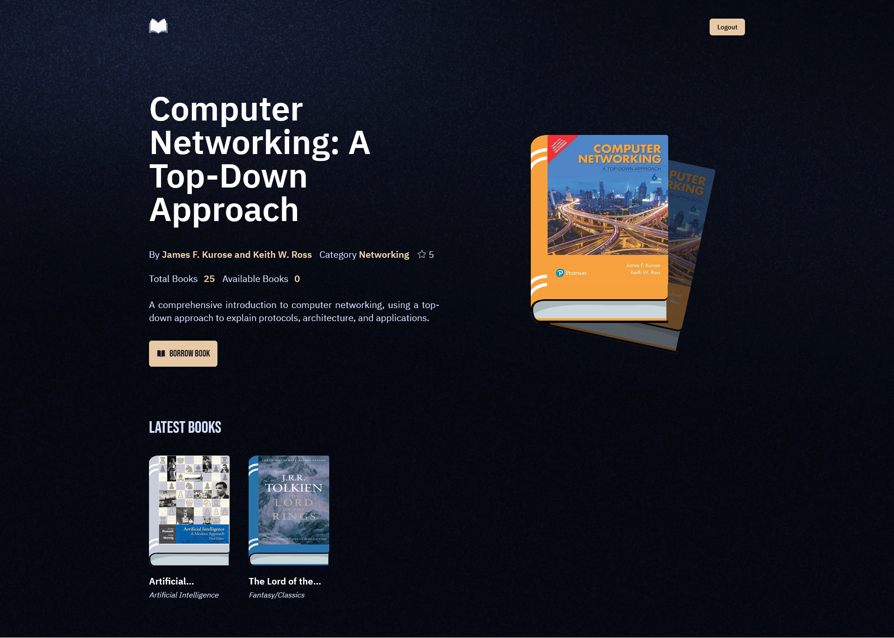
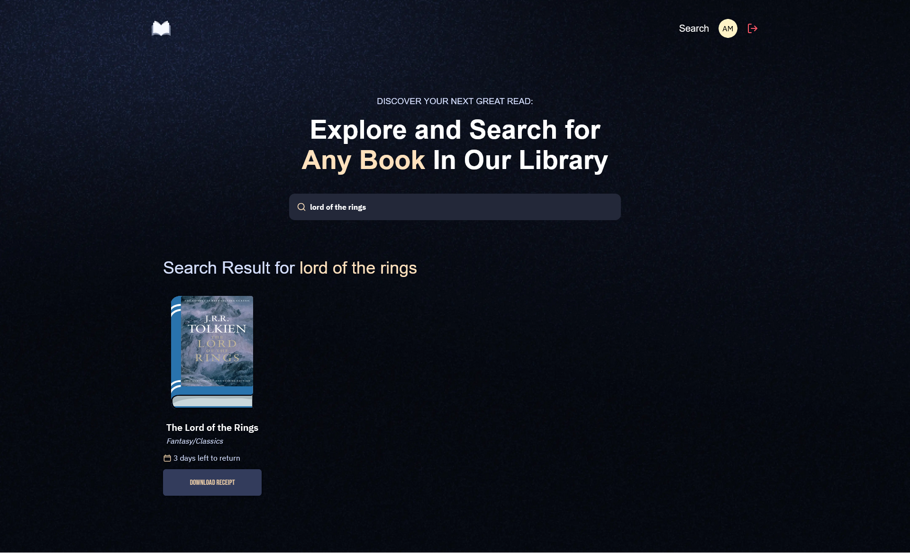
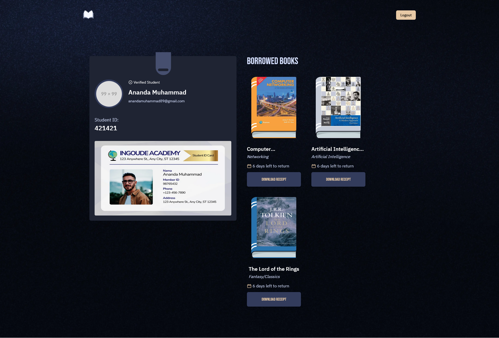
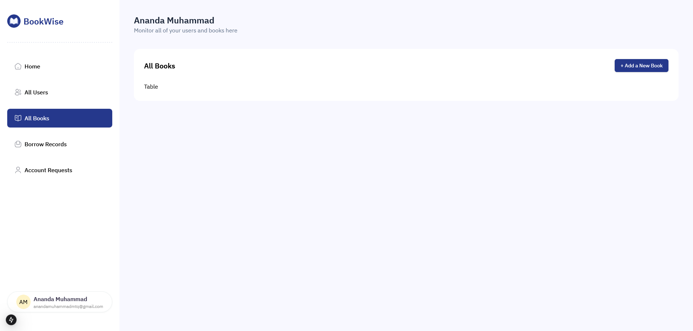
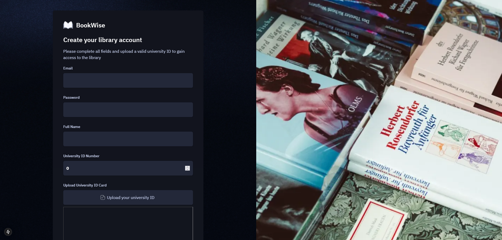

# BookWise 📚

**BookWise** is a modern university library management system designed to streamline book borrowing, user management, and administrative tasks. Built with cutting-edge technologies, BookWise offers a seamless experience for both administrators and users.

---

## Features

### Admin Panel

- **Users Management**: View and manage all registered users. (**In Progress**)
- **Borrow Requests**: Handle book borrowing requests efficiently. (**In Progress**)
- **Account Requests**: Approve or reject new user registrations. (**In Progress**)
- **Books Management**:
  - Create a book
  - List all available books. (**In Progress**)
  - Edit or remove books from the library. (**In Progress**)
- **Dashboard**: Quick access to all sections. (**In Progress**)

### User Panel

- **Profile Page**:
  - View borrowed books.
  - View personal information.
  - Track borrowed books and due dates.
  - Update personal information. (**Soon**)
- **Home Page**:
  - List all books
  - Books with detailed information.
  - Search for books by title
  - Pagination for books (**Soon**)
  - Search for books by author, genre (**Soon**)

---

## Tech Stack 🛠️

- **Frontend**:
  - Next.js 15
  - TailwindCSS
  - shadcn/ui (for beautiful, reusable components)
- **Backend**:
  - Next.js API Routes
  - NextAuth (authentication)
- **Database**:
  - PostgreSQL (hosted on Neon)
  - Drizzle ORM (type-safe database interactions)
- **Media Storage**:
  - ImageKit.io (for uploading and managing images/videos)
- **Caching & Real-Time Data**:
  - Upstash Redis (caching and real-time workflows)
- **Email Service**:
  - Resend (for sending emails, integrated with Upstash workflows)

---

## Getting Started 🚀

### Prerequisites

- Node.js (v18 or higher)
- [PostgreSQL](https://console.neon.tech/app/projects) database (Neon recommended)
- [Upstash](https://upstash.com/) account
- ImageKit.io account
- [Resend](https://resend.com/emails) API key

### Installation

1. Clone the repository:

   ```bash
   git clone https://github.com/your-username/bookwise.git
   cd bookwise
   ```
2. Install dependencies:
   ```bash
   npm install
   ```
3. Set up environment variables:
   Create a `.env` file in the root directory and add the following:

   ```env
    # ImageKit.IO
    NEXT_PUBLIC_IMAGEKIT_URL_ENDPOINT=
    NEXT_PUBLIC_IMAGEKIT_PUBLIC_KEY=
    IMAGEKIT_PRIVATE_KEY=

    NEXT_PUBLIC_API_ENDPOINT=http://localhost:3000
    NEXT_PUBLIC_PROD_API_ENDPOINT=deployed_url

    # Neon database
    DATABASE_URL=

    AUTH_SECRET= # Added by `npx auth`. Read more: https://cli.authjs.dev

    # Upstash redis
    UPSTASH_REDIS_URL=
    UPSTASH_REDIS_TOKEN=

    # Upstash qstash
    QSTASH_URL=
    QSTASH_TOKEN=

    # Required for receiving
    QSTASH_CURRENT_SIGNING_KEY=
    QSTASH_NEXT_SIGNING_KEY=

    # Resend
    RESEND_TOKEN=
   ```
4. Run database migrations:
   ```bash
   npm run db:generate
   npm run db:migrate
   ```
5. Run database migrations:
   ```bash
   npm run dev
   ```

---

## Acknowledgments 🙏

- [Next.js](https://nextjs.org/) for the powerful React framework.  
- [TailwindCSS](https://tailwindcss.com/) and [shadcn/ui](https://ui.shadcn.com/) for the stunning UI components.  
- [Neon](https://neon.tech/) for the serverless PostgreSQL hosting.  
- [Upstash](https://upstash.com/) for Redis caching and real-time workflows.  
- [Resend](https://resend.com/) for seamless email delivery.  

## Screenshots 📸

<div style="margin-top: 12px; margin-bottom: 12px">
  <a href="https://university-library-nu.vercel.app/">
    
  </a>
</div>

<div style="margin-top: 12px; margin-bottom: 12px">
  <a href="https://university-library-nu.vercel.app/">
    
  </a>
</div>

<div style="margin-top: 12px; margin-bottom: 12px">
  <a href="https://university-library-nu.vercel.app/">
    
  </a>
</div>

<div style="margin-top: 12px; margin-bottom: 12px">
  <a href="https://university-library-nu.vercel.app/">
    
  </a>
</div>

<div style="margin-top: 12px; margin-bottom: 12px">
  <a href="https://university-library-nu.vercel.app/">
    
  </a>
</div>

<div style="margin-top: 12px; margin-bottom: 12px">
  <a href="https://university-library-nu.vercel.app/">
    
  </a>
</div>

## Live Demo 🌐
[BookWise Demo](https://university-library-nu.vercel.app/)
